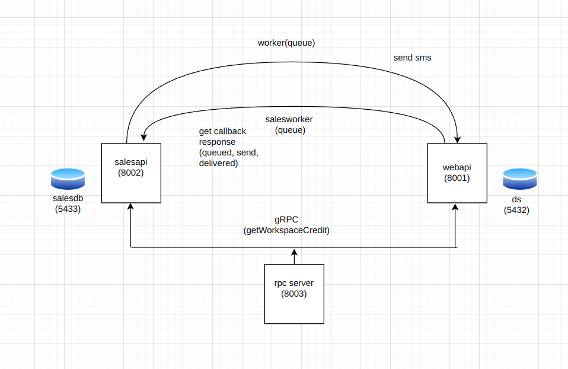

## Project Title
DS Bulksms Simulation

## About the project
This project is a system designed to simulate the process of sending bulk SMS messages, such as broadcasting messages to all students enrolled at the University of Oulu. In this scenario, each SMS sent incurs a cost of 0.1 credit from a predetermined balance.

Recognizing the resource-intensive nature of both sending SMS messages and handling delivery reports, we made the architectural decision to decompose the system into microservices. By doing so, we segmented functionalities into distinct components, each with its own database and web server instance. Despite this separation, we opted to maintain a shared Redis instance to facilitate inter-service communication and synchronization.

The primary objective of this architecture is to showcase effective communication and coordination among the various microservices. Through this setup, we aim to demonstrate how disparate components can seamlessly collaborate to manage the process of sending bulk SMS messages while efficiently handling related tasks, such as credit deduction and delivery status updates.

## Implementated components:
In our distributed system architecture, we operate three nodes, each hosting a distinct API server catering to specific functionalities:





1. **Node 1: Webapi**
   - Webapi functions as a node with its own database, housing tables such as `workspace`, which stores credit information.


2. **Node 2: Salesapi**
   - Salesapi operates as another node, managing a separate database comprising tables for `bulksms` and `bulksms_info`. These tables hold data related to bulk SMS campaigns and their associated information.

3. **Node 3: RPC Server**
   - This node serves as the RPC server, featuring an implementation of `gRPC` and corresponding `stubs` for communication purposes.

Our primary objective is to showcase effective communication between these distributed nodes. To achieve this, we've implemented several mechanisms for message exchange:


Our primary objective is to showcase effective communication between these distributed nodes. To achieve this, we've implemented several mechanisms for message exchange:

- **JobQueue:** Background workers, namely `general_worker` and `sales_worker`, are employed alongside job queues to facilitate communication between nodes. These workers handle tasks asynchronously, ensuring smooth interaction between different components of the system.

- **gRPC:** Utilizing `gRPC`, we've established communication channels between nodes, leveraging `protos` and `buffs` to execute functions such as fetching available credit via the `get_workspace_credit` method. Both `webapi` and `salesapi` nodes are capable of initiating and responding to RPC communications.

- **Pub/Sub:** To enable real-time message exchange, we've implemented a pub/sub architecture using `Redis`. By subscribing to a topic named `workspace_credit` and listening for updates via WebSocket, we can effectively track changes in credit availability across the system.


In our setup, both the `webapi` and `salesapi` servers have the capability to send and receive messages, provided they have the necessary resources. However, we encountered performance issues with database read/write operations. The task of sending SMS messages is initiated by the `salesapi` server through two REST APIs: `create(http://localhost:8002/create)` and `run(http://localhost:8002/run)`. The create API is responsible for preparing a bulk SMS campaign for execution, while the run API triggers the actual sending of SMS messages to the contacts listed in an uploaded CSV file.

Upon execution, the salesapi server receives response callbacks for each message sent to the contacts, indicating their status transition from `queued` to s`ent/failed`, `delivered`, or `undelivered`. However, the main challenge lies in efficiently updating these status transitions in the database, given the potentially high volume of messages being processed. Surely, there is a risk of contention for database resources, which can lead to locking mechanisms being invoked. Locks are used to ensure data consistency and prevent concurrent access to the same data by multiple processes. However, they can also introduce bottlenecks and performance issues, especially in situations where multiple transactions are attempting to read or write data concurrently.

Thus there is a need to ensure concurrency mechanisms. Thus in this project we have prepopulated the database `bulksms_info` for each contact before sending sms. And replacing the status by updating the response we get as a callbacks (i.e, `sent/failed`, `delivered/undelivered`).

Moreover, to assess the system's performance, we conducted evaluations using datasets of varying sizes, namely `5contacts.csv` and `5000contacts.csv`, upon triggering the `run` API. This allowed us to analyze the impact of message volume on CPU and memory usage, with the results detailed in the evaluation section below.


## Built with
- **Python**: A high-level programming language used for developing various components of the system due to its simplicity, readability, and extensive library support.

- **Starlette**: A lightweight ASGI framework used for building high-performance asynchronous web applications and APIs. It was used for handling WebSocket connections and routing.

- **asyncio**: A library in Python used for writing asynchronous code. It was used for managing asynchronous tasks such as handling WebSocket connections and sending messages asynchronously.

- **PostgreSQL**: A powerful open-source relational database management system used for storing and managing data. It was used for persisting data related to contacts, SMS campaigns, and other relevant information.

- **Redis**: An in-memory data structure store used as a database, cache, and message broker. It was used for caching data and possibly for queuing tasks asynchronously.

- **Docker**: A platform for developing, shipping, and running applications in containers. It was used for containerizing and deploying the microservices and other components of the system.

- **gRPC**: A high-performance RPC (Remote Procedure Call) framework developed by Google. It was mentioned in the context of communicating between microservices.

- **WebSocket**: A communication protocol that provides full-duplex communication channels over a single TCP connection. It was used for real-time communication between clients and the server.

- **KrispBroadcast**: A custom broadcast mechanism used for handling pub/sub communication. It facilitated the distribution of messages to WebSocket clients subscribed to specific topics.

- **JobQueue**: A mechanism used for queuing and processing background tasks asynchronously. It was used for processing tasks such as sending bulk SMS campaigns in the background.

- **Matplotlib**: A plotting library for Python used for creating static, animated, and interactive visualizations. It was suggested for generating graphical analyses of system stats collected during testing.

## Getting Started
This below is the mechanism for setting up project locally


## Install Python
### Windows:
1. **Download Python:**
    - Visit the official Python website at [python.org](https://www.python.org/) .
    - Navigate to the "Downloads" section.
    - Download the latest version of Python for Windows.
2. **Run the Installer:**
    - Run the downloaded installer.
    - Check the box that says "Add Python to PATH" during installation.
3. **Verify Installation:**
    - Open a command prompt and type: 
```
python3 --version
```
### Linux:
1. **Install Python:**
    - Python is often pre-installed on Linux. To install or update Python, use your package manager:
```
sudo apt update
sudo apt install python3
```
1. **Verify Installation:**
    - Open a terminal and type:
```
python3 --version
```
## Install and Activate Virtual Environment
### Windows:
1. **Open a Command Prompt:**
    - Open a command prompt or PowerShell.
2. **Install **`**virtualenv:**` 
```
pip install virtualenv
```
**Create a Virtual Environment:**

- Navigate to your project directory.
- Create a virtual environment by running:
```
python -m venv venv
```
**Activate the Virtual Environment:**

- Activate the virtual environment:
```
  .\venv\Scripts\activate
```
### Linux:
1. **Open a Terminal:**
    - Open a terminal.
2. **Install **`**virtualenv:**` 
```
sudo apt install python3-venv
```
**Create a Virtual Environment:**

- Navigate to your project directory.
- Create a virtual environment by running:
```
python3 -m venv venv
```
**Activate the Virtual Environment:**

- Activate the virtual environment:
```
source venv/bin/acivate
```
## Deactivate Virtual Environment
To deactivate the virtual environment, simply run:

### Windows and Linux:
```bash
deactivate
```
## Installing requirements
```
pip install -r requirements.txt
```


<!--
## Postgres Installation

### Windows

1. Download the PostgreSQL installer from the [official website](https://www.postgresql.org/download/windows/).
2. Run the installer and follow the on-screen instructions.
3. During installation, you'll be prompted to set a password for the default `postgres` user.

### Linux

1. Install PostgreSQL using your distribution's package manager. For example, on Ubuntu, you can run:
```
sudo apt update
sudo apt install postgresql postgresql-contrib
```

### macOS

1. Install PostgreSQL using Homebrew. Run the following command in your terminal:
```
brew install postgresql
```

## Configuring database
1. After installing PostgreSQL, you can access the PostgreSQL command-line interface (CLI) using the following command:
```
psql -U postgres
```

2. Once you are in the PostgreSQL CLI, you can create and setup a  new database using the following SQL command:
```
CREATE DATABASE mydatabase;
CREATE USER myuser WITH PASSWORD 'mypassword';
GRANT ALL PRIVILEGES ON DATABASE mydatabase TO myuser;
```

## Accessing PostgreSQL

### Windows

- You can access PostgreSQL using the pgAdmin tool, which is installed along with PostgreSQL on Windows.

### Linux and macOS

- Access PostgreSQL using the `psql` command-line tool:
```
psql -U myuser -d mydatabase -h localhost -p 5432
```
-->

## Docker orchestration
We can also setup the database and redis using docker 
```
docker-compose -f webapi/docker-compose.yaml up -d
```

We can prepopulate the db using these commands
```
cat salesdb_dump.sql | docker exec -i db_salesdb psql -U postgres -d salesdb
cat ds_dump.sql | docker exec -i db_ds psql -U postgres -d ds
```
This populates the two databases `salesdb` and `ds` with `salesdb_dump.sql` and `ds_dump.sql` files.


## Migrating the database
And then running alembic commands as
```
cd bulksms/
alembic upgrade heads
```
This will create tables bulksms, bulksms_info on database salesdb 


```
cd workspace/
alembic upgrade heads
```
This will create table workspace on database ds


## Running the backend server
**Run the Application:**
### Webapi:

```
python console.py webapi serve
```
- This will serve the webapi on  [http://127.0.0.1:8000/](http://127.0.0.1:8000/) or [http://localhost:8000/](http://localhost:8000/) .
- You should see the webapi application running.
- Webapi uses database ds running on port 5432


### Salesapi:

```
python console.py salesapi serve
```
- This will serve the salesapi on  [http://127.0.0.1:8002/](http://127.0.0.1:8002/) or [http://localhost:8002/](http://localhost:8002/) .
- You should see the salesapi application running.
- Salesapi uses database salesdb running on port 5433.

### RPC server:

```
python console.py rpc serve
```
- This will serve the rpc on  [http://127.0.0.1:8003/](http://127.0.0.1:8003/) or [http://localhost:8003/](http://localhost:8003/) .
- You should see the rpc application running.
- This is an implementation of gRPC


### Queue worker:

```
arq webapi.webapi.worker_swarm.general_worker.WorkerSettings
```
- This will serve the redis Jobqueue for webapi

```
arq salesapi.salesapi.worker_swarm.sales_worker.WorkerSettings
```
- This will serve the redis Jobqueue for salesapi
